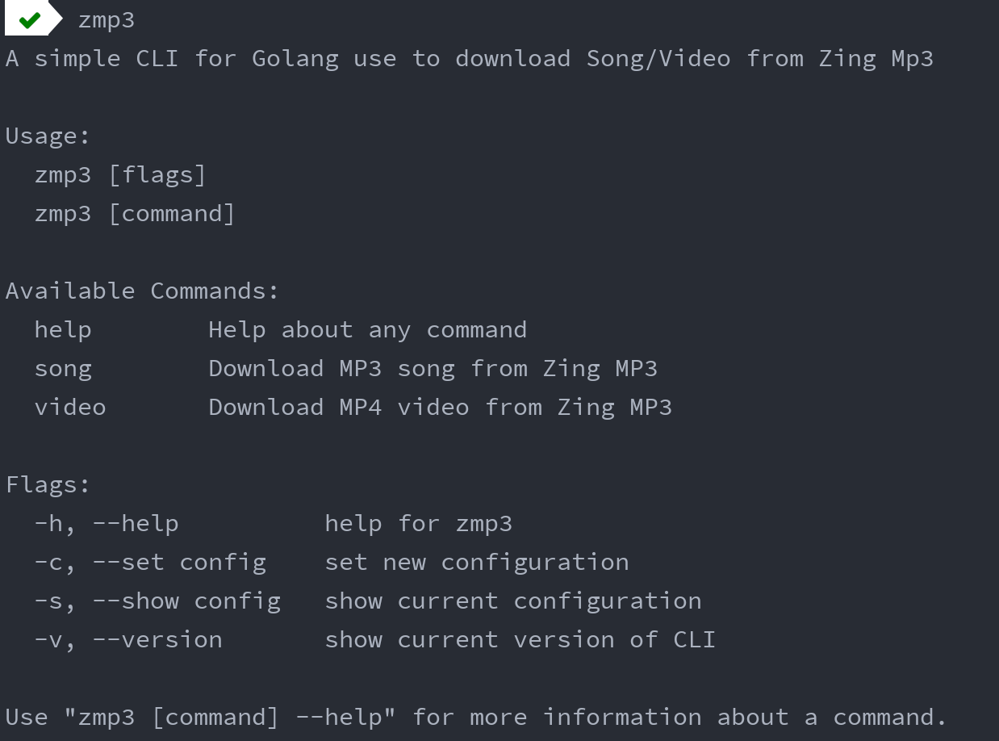
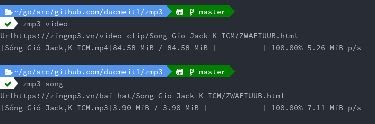
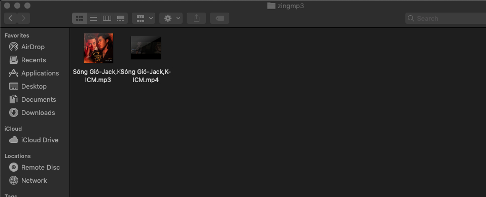

## Introduction

zmp3 is a CLI tool helps you download highest quality of music and video on https://mp3.zing.vn for free

Tutorial for development this CLI at: https://medium.com/@ducmeit/make-a-great-downloader-cli-by-cobra-viper-promptui-at-golang-f6408434cafa

## Usages

- Installing: `go install github.com/ducmeit1/zmp3`
- Downloading at: `https://github.com/ducmeit1/zmp3/releases`

## Pictures

- Progress bar when downloading

- Result after downloaded complete

